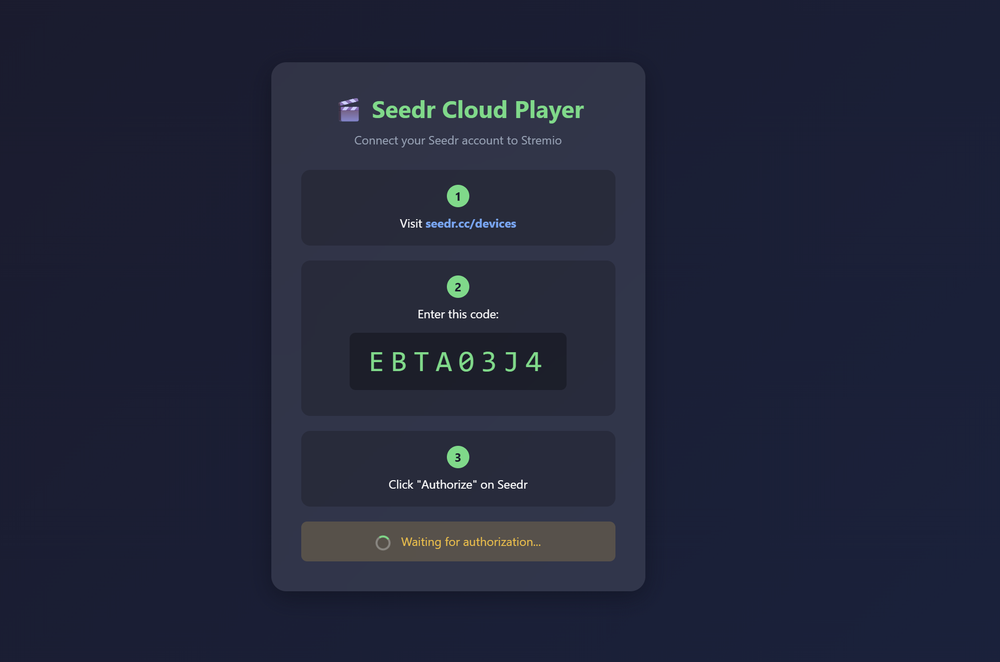
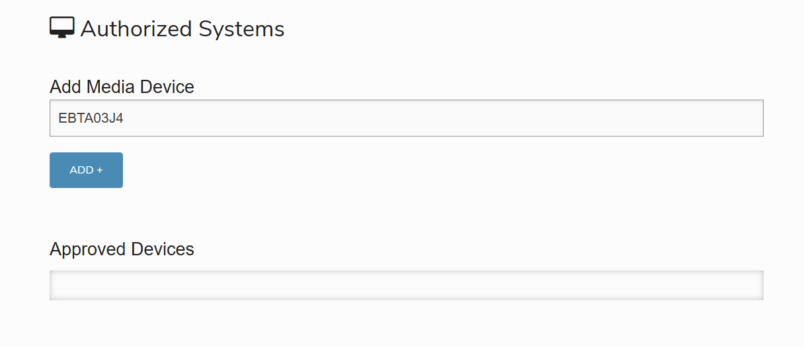
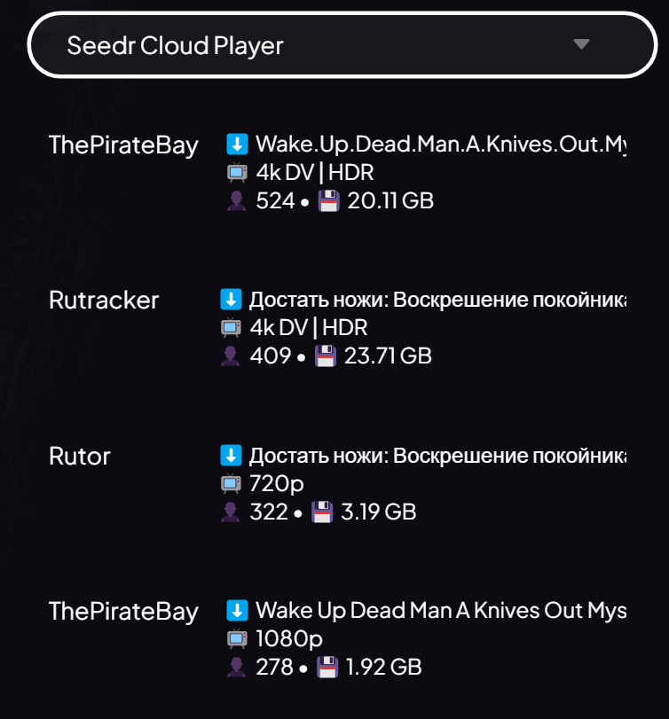

# 🎬 Stremio Seedr Addon

> Stream movies and series from your Seedr cloud storage directly in Stremio. Automatically discovers torrents via Torrentio and downloads them to your Seedr account for instant streaming.

[](https://nodejs.org/)
[](https://vercel.com/new/clone?repository-url=https://github.com/aryalsuman/stremio-seedr-addon)
[](https://opensource.org/licenses/MIT)

---

## ✨ Features

- 🔐 **Secure Device Authentication** - No password entry required, uses Seedr's OAuth device flow
- 🎯 **Torrentio Integration** - Automatically discovers torrents for any movie or series
- ⚡ **Auto-Download** - Torrents are downloaded to Seedr on-demand when you click play
- 🗑️ **Smart Storage Management** - Automatically clears Seedr storage when full
- 📺 **Multi-Format Support** - Works with movies, TV series, and anime (IMDB + Kitsu)
- 🔍 **Search Your Files** - Browse and search your existing Seedr library
- 📊 **Download Progress** - Monitor active downloads in real-time

---

## 📸 Screenshots

### Configure Page

*Get your device code and authorize the addon with your Seedr account*

### Seedr Authorization

*Enter the code at seedr.cc/devices to connect your account*

### Stream Selection

*Choose from available streams - ready to play (✅) or download first (⬇️)*

---

## 📋 Requirements

- **Node.js** 20.x or higher (for local development)
- **Seedr Account** - [Free](https://www.seedr.cc/) or Premium
- **Stremio** - [Download here](https://www.stremio.com/downloads)

---

## 🚀 Quick Start (Local Development)

```bash
# Clone the repository
git clone https://github.com/aryalsuman/stremio-seedr-addon.git
cd stremio-seedr-addon

# Install dependencies
npm install

# Start the server
npm start
```

The addon will be running at `http://127.0.0.1:8000`

Open `http://127.0.0.1:8000/configure` to connect your Seedr account.

---

## ☁️ Deploy to Vercel (Recommended)

Deploying to Vercel gives you a permanent URL that works 24/7 without running a local server.

### Step 1: Fork the Repository

1. Click the **Fork** button at the top of this repository
2. This creates a copy in your GitHub account

### Step 2: Import to Vercel

1. Go to [vercel.com](https://vercel.com) and sign in with GitHub
2. Click **"Add New..."** → **"Project"**
3. Find and select your forked `stremio-seedr-addon` repository
4. Click **"Import"**

### Step 3: Configure & Deploy

1. Leave all settings as default (Framework: Other)
2. Click **"Deploy"**
3. Wait for deployment to complete (usually 1-2 minutes)

### Step 4: Get Your Addon URL

1. Once deployed, copy your Vercel URL (e.g., `https://stremio-seedr-addon.vercel.app`)
2. Visit `https://YOUR-VERCEL-URL/configure` to set up Seedr

```
┌─────────────────────────────────────────────────────────────┐
│                                                             │
│   Your Addon URL:                                           │
│   https://your-project-name.vercel.app                      │
│                                                             │
│   Configure Page:                                           │
│   https://your-project-name.vercel.app/configure            │
│                                                             │
└─────────────────────────────────────────────────────────────┘
```

---

## � Self-Hosting Benefits & Privacy

When you deploy your own instance, you get **complete privacy and isolation**:

### Why Self-Host?

| Benefit | Description |
|---------|-------------|
| 🔐 **Token Privacy** | Your Seedr access token stays on YOUR Vercel instance only |
| 🚫 **No Shared Servers** | You're not sharing infrastructure with other users |
| ⚡ **No Rate Limits** | Your own instance = your own API limits |
| 🛡️ **Full Control** | You can inspect the code and verify nothing malicious is happening |

### How Authentication Works

This addon uses Seedr's **public OAuth client** (`seedr_xbmc`) - the same one used by Kodi/XBMC. This means:

- ✅ No need to register your own OAuth application
- ✅ No environment variables or secrets to configure  
- ✅ Tokens are valid for 1 year
- ✅ Just deploy and configure - it works out of the box!

## �🔗 Connect with Seedr

After deployment, follow these steps to connect your Seedr account:

### Step 1: Open Configure Page

Visit your addon's configure page:
- **Local:** `http://127.0.0.1:8000/configure`
- **Vercel:** `https://YOUR-VERCEL-URL/configure`

### Step 2: Get Device Code

You'll see an 8-character code like `A1B2-C3D4`

```
┌──────────────────────────────────────┐
│                                      │
│   Your Device Code:                  │
│                                      │
│        ┌──────────────┐              │
│        │   A1B2-C3D4  │              │
│        └──────────────┘              │
│                                      │
│   Enter this code at:                │
│   https://www.seedr.cc/devices       │
│                                      │
└──────────────────────────────────────┘
```

### Step 3: Authorize on Seedr

1. Open [https://www.seedr.cc/devices](https://www.seedr.cc/devices) in a new tab
2. Log in to your Seedr account if needed
3. Enter the 8-character code
4. Click **"Authorize"**

### Step 4: Wait for Confirmation

The configure page will automatically detect when you've authorized. This usually takes 5-10 seconds.

### Step 5: Install in Stremio

Once authorized, you'll see two options:

**Option A: One-Click Install (Recommended)**
- Click the **"Install in Stremio"** button
- Stremio will open automatically and add the addon

**Option B: Manual Install**
1. Copy the manifest URL shown on the page
2. Open Stremio → Settings → Addons
3. Paste the URL in the addon search box
4. Click **Install**

---

## 📺 How to Use

### Browse Your Seedr Files

1. Open Stremio
2. Go to **Discover** tab
3. Scroll down to find **"My Seedr Files"** catalog
4. Browse or search your uploaded content

### Stream Movies & Series

1. Search for any movie or TV series in Stremio
2. Click on the title to open it
3. Look for streams with the **Seedr** label:
   - ✅ **Ready** - File is in your Seedr, streams instantly
   - ⬇️ **Download** - Will download to Seedr first, then stream

4. Click a stream to start watching!

### Monitor Downloads

- Active downloads appear in the **"Seedr Downloads"** catalog
- Downloads typically complete in 1-5 minutes depending on size
- Once complete, the stream becomes available with ✅ status

---

## 🏗️ Architecture

```
┌─────────┐     ┌─────────────────┐     ┌───────────┐
│ Stremio │────▶│  Seedr Addon    │────▶│ Seedr API │
└─────────┘     │  (Your Server)  │     └───────────┘
                │                 │
                │  - Catalog      │     ┌─────────────┐
                │  - Streams      │────▶│ Torrentio   │
                │  - Resolve      │     │     API     │
                └─────────────────┘     └─────────────┘
```

### Request Flow

1. **Catalog Request** → Returns list of files in your Seedr account
2. **Stream Request** → Fetches available torrents from Torrentio + checks Seedr library
3. **Resolve Request** → Downloads torrent to Seedr and returns streaming URL

---

## ❓ Troubleshooting

### "Authorization Failed" or Code Expired

- Device codes expire after 5 minutes
- Refresh the configure page to get a new code
- Make sure you're logged into the correct Seedr account

### "Storage Full" Error

- The addon automatically clears your Seedr storage when full
- If issues persist, manually delete files at [seedr.cc](https://www.seedr.cc)
- Consider upgrading to Seedr Premium for more storage

### Streams Not Appearing

- Wait 10-30 seconds for Torrentio to respond
- Some obscure titles may not have available torrents
- Check if the title exists on [torrentio.strem.fun](https://torrentio.strem.fun)

### "Download Taking Too Long"

- Large files (10GB+) may take several minutes
- Check download progress in Seedr web interface
- The addon has a 5-minute timeout for downloads

### Addon Not Showing in Stremio

- Make sure you installed with the correct manifest URL
- Try uninstalling and reinstalling the addon
- Restart Stremio completely

### Connection Errors on Vercel

- Verify your deployment is active at vercel.com
- Check Vercel function logs for errors
- Ensure Node.js version is set to 20.x in Vercel settings

---

## 📁 Project Structure

```
stremio-seedr-addon/
├── server.js        # Express server, routes, OAuth flow UI
├── addon.js         # Stremio catalog & stream handlers
├── seedrApi.js      # Seedr API client (auth, files, streaming)
├── torrentioApi.js  # Torrentio API client (stream discovery)
├── package.json     # Dependencies and scripts
├── vercel.json      # Vercel deployment config
└── docs/
    └── screenshots/ # Screenshot images for README
```

---

## 🤝 Contributing

Contributions are welcome! Feel free to:

1. Fork the repository
2. Create a feature branch (`git checkout -b feature/amazing-feature`)
3. Commit your changes (`git commit -m 'Add amazing feature'`)
4. Push to the branch (`git push origin feature/amazing-feature`)
5. Open a Pull Request

---

## 📄 License

This project is licensed under the MIT License - see the [LICENSE](LICENSE) file for details.

---

## 🙏 Credits

- [Stremio](https://www.stremio.com/) - The streaming platform
- [Seedr](https://www.seedr.cc/) - Cloud torrent service
- [Torrentio](https://torrentio.strem.fun/) - Torrent stream discovery

---

## ⚠️ Disclaimer

This addon is for personal use only. Users are responsible for ensuring they have the right to access any content they stream. The developers of this addon do not host, provide, or distribute any media content.
